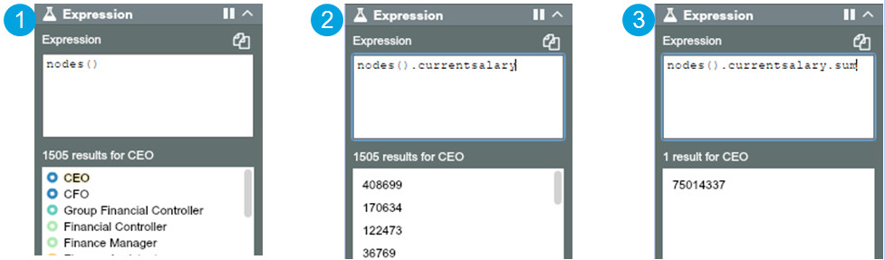

## Basic grammar and elements
An Expression is built up gradually by chaining elements such as node, property, filter, group by and aggregators and methods. These elements are separated by . (dot) syntax. You start with the highest level collection you can, 'node' or 'nodes()' and then you access properties or values from this collection to define a subset of the data on which to perform an operation. 

Every time you add something after a dot ('.') it is acting on the input data specified before the dot. For example, 

For the collection 'nodes‘ (1), give me the current salaries (2), from the collection of ‘current salaries’, give me the sum (3).

