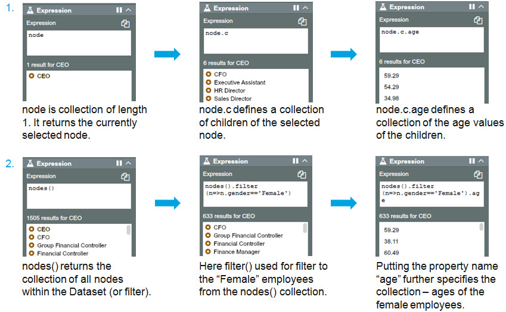

## Understanding nodes and ‘collections’
In OrgVue, data are held in a database called a graph. Nodes are used to represent entities such as employees and activities (or any items you might want to keep track of) and store data. When you access data in OrgVue, it is always represented as a ‘collection’. 

For example:

