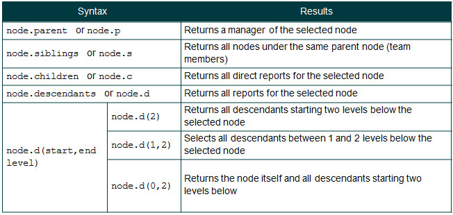

## Accessing properties
Any property in the Dataset can be accessed (and then manipulated) by using this syntax – including metadata and relationships as well as normal Dataset properties.

1. Dataset properties:
	* The most common collections to follow `node.` or `nodes().` are data properties
	* Example: `node.fullname` will return a value stored in the Full Name property for a node
	* Dataset properties come in 5 main types; Number, Text (string), Date, Boolean, Image. More exotic types are also supported, including functions, arrays and objects
	* The data type of a property affects the range of methods that can be applied to it, e.g. you can’t average a string (text)

    ** Note: ** Typing in `node` or `nodes()` in Expression Panel will list all of the data properties in the Dataset.

2. Metadata properties: 
	* Example: ‘node.isorphan’ will return a value; true/ false and ‘node.depth’ returns the depth of the currently selected node
	* OrgVue generates metadata properties automatically. These properties describe the node itself, and are present as options in a Dataset regardless of what other data it contains
	* We have already seen that metadata properties are listed in italics at the bottom of property list on Side Panel and the Filter Control – *see Basic Training Chapter 4 for further details*

3. Relationship properties:
	* Node relationships are stored as a special type of property
	* This allows you to reference nodes through their hierarchical relationships to one another
	