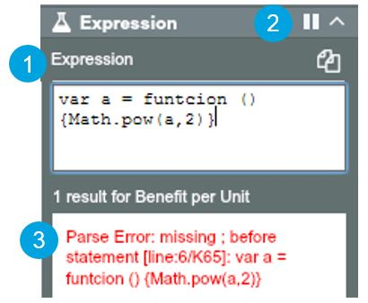

# Expression Panel

The Expression Panel is useful because it can evaluate expressions on the fly. It is a great way of testing whether your expression is valid, or finding out some data without having to alter the value of any cell in the Dataset. Some practical tips:

1. Click ‘Expression’ to switch to ‘Macro’ mode (and click ‘Macro’ to switch back to Expression mode). An expression is evaluated while you type in Expression mode. Macro mode stops this and the result is returned only after pressing Ctrl+Enter or clicking the ‘play’ icon – this is useful when you write long expressions

2. Clicking the ‘pause’ icon allows you to keep the node selected as the focus of an expression - avoiding it being repointed/ recalculated when other nodes are selected

3. The result pane
    * When you type an expression and it is evaluated, a value will be returned in the Results Pane
    * This is also where error messages occur. E.g. “Parse Error…” means you have made a syntax mistake in the expression
    * The ‘clipboard’ icon allows you to copy out the expression result

