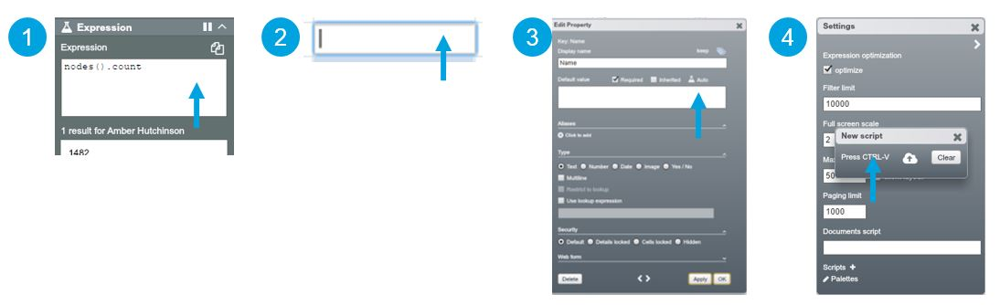

## Introduction

Data in OrgVue is stored as nodes which have properties. Expressions allow you to manipulate these node.property values. Gizmo is the scripting language that is used to write these expressions.

Gizmo is a functional subset of JavaScript, designed to be expressive of intent. It is one of the core languages used to develop OrgVue along with Scala. This is quite unusual – imagine Excel being written using the same language that you type into cells to perform functions.

Expressions can be understood as the OrgVue equivalent of Excel formulas. They can be written in several places to serve different use cases: 

1. in the Expression Panel: when you want to perform a calculation on-the-fly 
2. within a cell: when you want to return a value for specific cells
3. within the default value box of a property Dialogue: when you want to apply an expression for all nodes for that property – creating an evaluated property
4. within scripts that extend the product: when you want to centrally store a large number of expressions or perform complex calculations.

