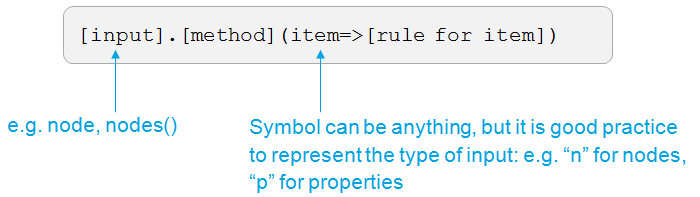

# Lamda expression n=>n
Lambda expression allows you to take in a set of collections and apply a method to every member of the collection (this is why it is used in `filter()` and `map()` expressions).
`n=>n` is equivalent to `function(n){n}` but faster to type and able to be nested within other functions. It also decreases the evaluation time of expressions and minimises the performance burden on your dataset.

### Generic form

### Example
To view filtered list containing only non-generated properties
`view.properties.filter(p=>!p.isgenerated)`

