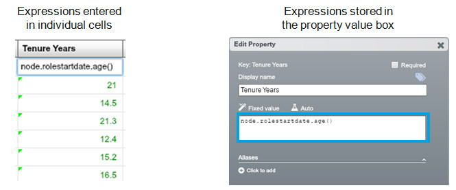

## Write expressions in the property value box (not individual cells)

If you want to create a calculated property, writing the expression in the property value box (in the Edit Property dialog) is by far the best way of doing it. Writing directly into cells means that the expression has to be compiled for every node, rather than just once, and can cause larger datasets to run very slowly.
More effectively stored expressions are still evaluated for every node but can be executed much faster.  Storing expressions in the property value box means they are still evaluated for every node but are only compiled once.
Writing an expression directly into a cell should therefore be avoided unless you only want to change one or two nodes. 

** Note: ** If you want to perform an on-the-fly calculation or experiment with writing expressions, use the Expression Panel.