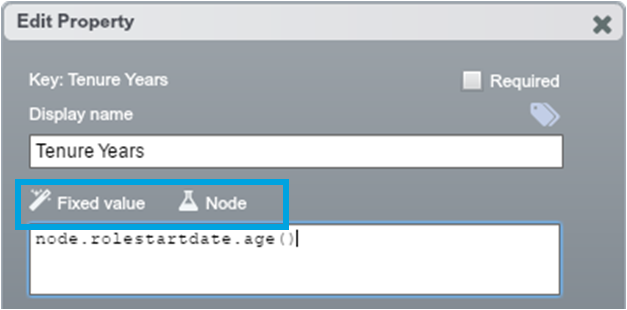
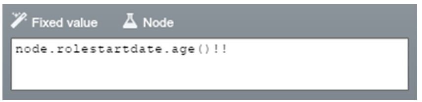

## 3. Configure expressions so they re-calculate only as needed

The way OrgVue populates and evaluates the values can be optimised through the appropriate use of value modes and evaluation modes in the ‘Edit Property’ dialogue. For example:
* The most common choice for expressions is to use ‘Fixed’ (value mode) + ‘Node’ (evaluation mode)
* If the dataset is large, there are lots of expressions, or performance is critical, ‘Fixed’ + ‘Script’ (and settemporary) is recommended

Re-calculation can be further controlled (prevented and forced) through double-splash(!!) and the recalculation icon.

---

** 4 value modes ** in the ‘Add/ Edit Property’ dialogue are aimed at increasing the flexibility of value population.

| Value mode        | Description (use cases)              |
|------------------------- |------------------------------------| 
| Fixed value | All nodes will return this value, regardless of what has been entered in the cells themselves. | 
| Default value | Nodes with an existing value retain that value. If a node has a blank value, it is replaced with the Default Value.      |   
| Inherited value | Nodes with an existing value retain that value. Blank nodes ‘look’ up their hierarchy and inherit the value from their nearest ancestor with a non-null value. If all ancestors have a blank value, nodes will take the Default Value.[^1]  |   
| Initial value| Can only be used when creating a property or new node. Sets the first value for that property of those nodes.[^2]|   

[^1] This can be thought of as a property of a hidden node that is the ultimate root of the tree – the so-called ‘Mother of all Nodes’

[^2] When using the Fixed, Default and Inherited modes the cells appear to contain a value but are blank when clicked on. Values set using ‘Initial’ mode are persisted into the cell itself. If you want to paste a hard value into cells, “Initial” is a convenient alternative to a double-splash (!!*)

** Note: ** Among 4 value modes, the ‘Fixed’ value mode is best practice for most cases.

---
**6 evaluation modes ** in the ‘Edit Property’ dialogue are used to reduce the data OrgVue scans and the number of times expressions are re-evaluated, increasing the speed of OrgVue. Using these evaluation types you can configure under what circumstances the value of that property is recalculated for a given node, and how.

The value is set via an expression or script executed from outside this property.

| Evaluation mode| What needs to be changed to prompt a re-calculation of a node’s value?| What happens during re-calculation? |
| ------------- |:------------------------------------:| :------------------------------------:| 
| Auto | Any node’s value for that property | Recalculate all the nodes in the dataset|
| Node | One of that node’s values | Recalculate that node |  
| On demand | Force re-calculation by pressing the re-fresh icon | Recalculate all the nodes in the dataset |
| Hierarchical | One of that node’s values|Recalculate that node and all its ancestors|
| Script | The property containing node.settemporary got evaluated[^*]  | N/A |
| None | It will not be recalculated outside of a deep refresh | N/A |

[^*] The value is set via an expression or script executed from outside this property.

** Note: ** ‘Node’ is the most common type to use.

Avoid using the ‘Auto’ evaluation mode* which detects expressions (at a high performance cost) and evaluates them whenever data changes. Picking the appropriate evaluation type for each property will increase performance by stopping expressions needlessly recalculating :
* Choose the ** On demand** mode when the property needs evaluation occasionally
* Choose the ** Node ** mode when the expression only needs to be re-evaluated when the node is changed
* Choose the ** Hierarchy ** mode when the expression is dependent upon the node’s descendants e.g. as node.rollup(“salary”,”sum”)
* Choose the ** None ** mode when no cell for this property should be evaluated as an expression.
* Choose the ** Script ** mode when using settemporary to set a single expression to return multiple properties

** Note: ** As OrgVue’s default (in Auto mode), every time the data are loaded it scans all the values for every property until it encounters an expression. It might be that OrgVue scans 50,000 nodes in a dataset to find only the last node has an expression for that property value. This increases the time it takes OrgVue to load or re-process a dataset. As a result of OrgVue having to scan a large number of cells, slow loading especially affects large datasets. 

---

If you only need the expression to be calculated once (or rarely) and remain static most of the time , you can **‘prevent’ or ‘force’ re-evaluation **, providing more control.
** Prevent** your expressions being re-calculated when you don’t want them to by adding a “!!” to the end:

The results will now be hard-written into the cells (cf. “Initial” value mode). To trigger a recalculation, remove all the values from your property by blank double-splashing (!!*) 

** Note: **
In general, recalculation is executed when:
* the dataset is opened
* the dataset is saved
* the data is edited
* you click the ‘Resume recalculation’ icon or the ‘refresh’ icon
