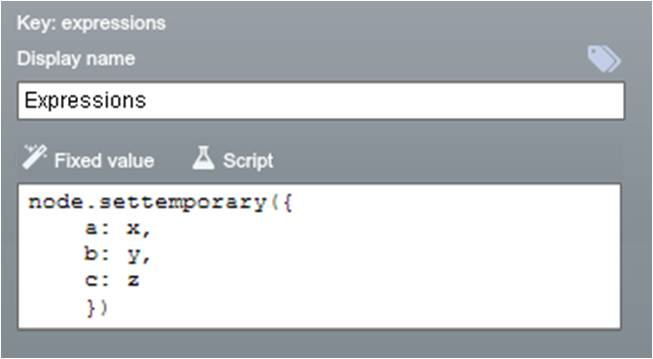
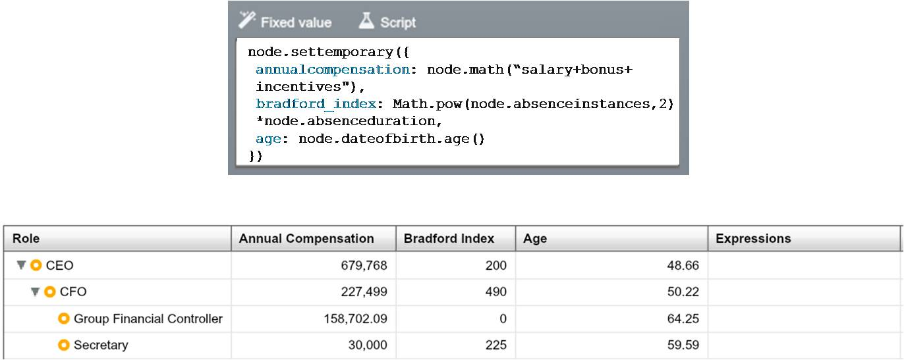

## Use ‘settemporary’ to evaluate all your properties in one 
Rather than typing individual expressions directly into the Default Value box for properties to be calculated, OrgVue enables multiple properties to be set via a single expression held in a specified property. This means only one expression is evaluated for each node but a range of calculated values are returned for multiple properties; this:
* Increases performance in datasets where multiple properties contain calculated values
* Allows the reuse of traversals (expressions calculating up and down the tree) without needed to perform these calculations again/ rely on dependency order

To use settemporary:
1. Create a property called “Expressions” (or indeed, any other convenient name)
2. Set the default value of this property as “node.settemporary({ a:x, b:y, …, c:z})” where:
	* a, b, c = the names of properties* that are going to be populated with calculated values, and 
	* x, y, z = the expressions to be evaluated
> ** Note:** the names that need to be listed are the property key values, exactly as they appear in the Edit Property dialogue. You cannot include any dependencies in the settemporary expression, so you couldn’t include bonus (10% of salary) and total cost (salary+bonus).
3. Set the evaluation type of all the properties evaluated in this way to “Script”.

Create In this way, the default expressions you would usually enter into each property separately can all be combined, and evaluated, as a single property.
The other properties are updated when the settemporary expression is evaluated, which is dependent on its own evaluation mode.

